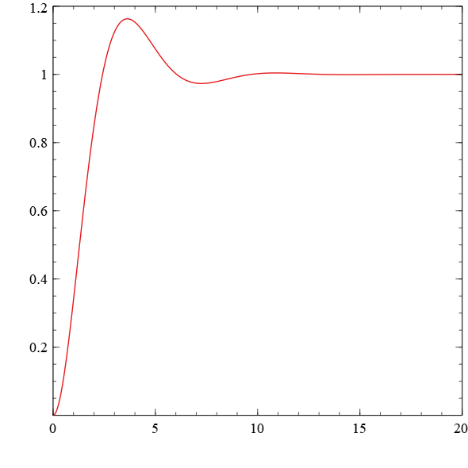

TWMATH
======

*! In heavy developement !*
*! developement has been stalled in favour of my plotting library, that this project will depend on: https://github.com/TobiasWallner/plotpp !*

A library for controll systems engineering that brings transfere functions, laplace variables, and complex system analysis to C++. This will allow you to devolpe and analyse and test the exact same code on your PC that will later run on your micro-processor.

```C++
// develope controll systems with the complex laplace variable 's'
const auto s = tf::s;
const auto G = (1.f) / (1 + s + s*s);

// transform the transfere function into its matrix system form
const auto Gsys = c_state_space(G);

// discretise the system
// for example to the smaple rate of your ADC
// uses exact zero-order-hold discretisation
const auto Gsys_d = discretise(Gsys, 0.01);

// plot your calculations 
// (for plotting: see my other library https://github.com/TobiasWallner/plotpp)
const auto ts = stepplot(Gsys_d, 20);

// save the stepplot
std::ofstream file("step.csv");
file << "t, value" << std::endl;
file << ts << std::endl;
```
Resulting plot of: `G = (1.f) / (1 + s + s*s)`


Linear Algebra
--------------
### Static Vector
A vector with static fixed size and capacity that is stored on the stack. Used for small vectors of fixed size.

### Hybrid Vector
A vector with dynamic size and fixed capacity that is stored on the stack. Used for small vectors of variing size.

### Dynamic Vector
A vector with dynamic size and capacity that is allocated on the heap. Used for large vectors. 

### Static Vector
A vector with static fixed size and capacity that is stored on the stack. Used for small vectors of fixed size.

### Hybrid Vector
A vector with dynamic size and fixed capacity that is stored on the stack. Used for small vectors of variing size.

### Dynamic Vector
A vector with dynamic size and capacity that is allocated on the heap. Used for large vectors. 

Polynomials
-----------

### Polynomial

### Rational Polynomial

Controll Systems
----------------

#### Continuous Transfer Function

### Discrete Transfer Function

### Continuous State Space Systems

### Discrete State Space Systems

### System Analysis

Error Management
----------------
By default assertions are on, that check for example if an element access is within the allocated storage size (Aka.: Out of bounds access, buffer bverflow). 
This, however, has an impact on performance. To increase performance those assertions can be disables by compiling with the definition: `DISABLE_TWMATH_ASSERTIONS`.

```CMake
target_compile_definitions(${PROJECT_NAME} PUBLIC
	DISABLE_TWMATH_ASSERTIONS
	...
)
```

Customise the behaviour of the error management can be customised with the following definitions. Select only one!
* `TWMATH_THROW´ **default** throws an exception of type runtime error with a message descibeing the failed assertion.
* `TWMATH_EXIT` calls exit(-1) to exit the program (customiseable error output stream)
* `TWMATH_TRAP` traps the execution in a while loop (customiseable error output stream)
* `TWMATH_CUSTOM_ERROR_HANDLER` calls the user defined function: 'void twmath_custom_error_handler(const char* error_message)'

```CMake
target_compile_definitions(${PROJECT_NAME} PUBLIC
	TWMATH_THROW|TWMATH_EXIT|TWMATH_TRAP|TWMATH_CUSTOM_ERROR_HANDLER
	...
)
```

Furthermore you can define the error output stream that should be used when `TWMATH_EXIT` or `TWMATH_TRAP` is selected. The default is: `TWMATH_CERR std::cout`.
```CMake
target_compile_definitions(${PROJECT_NAME} PUBLIC
	TWMATH_CERR my::cerr
	...
)
```
